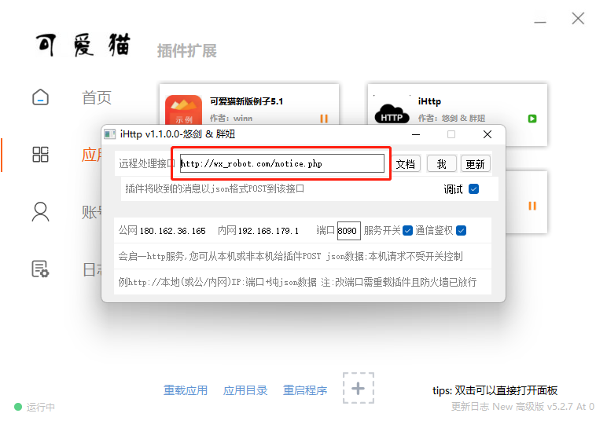

# Http_Sdk_For_Lovely_Cat
 一个为可爱猫机器人服务的sdk，含详细的文档和插件包

插件配置如上图，

因为这个插件有段时间，无法登录使用了。所以我把登录使用去掉了。

通信鉴权，秘钥默认为666666

所以服务端的`authorization.txt`文件，内容写成666666就可以了。

此外你担心鉴权秘钥被一些人撞到了...你完全可以把处理接口url写的复杂点or无厘头(xyxnotice123)，都可以解决问题的。

另外：

这个作者插件也开源了。这里就放一份我修改过的。由易语言编写的，有能力的同学可以自己改改（可动态修改鉴权），总之我没学过，看中文式的开发语言也费劲，就没有研究。
